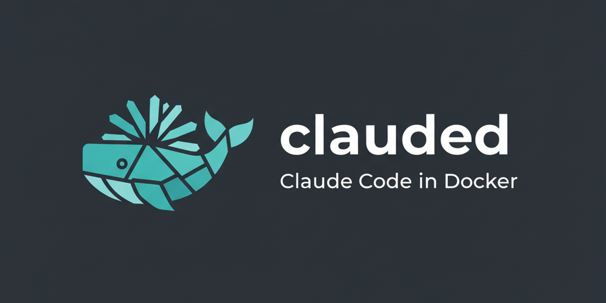
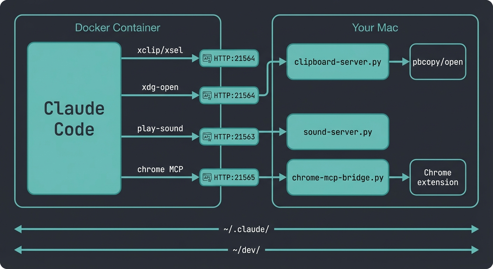

<p align="center">
  
</p>

<p align="center">
  <strong>Run Claude Code in Docker with full feature parity.</strong><br>
  Sandboxed sessions with clipboard, browser control, MCP servers, parallel sessions, and sound notifications — all bridged seamlessly to your Mac.
</p>

<p align="center">
  <a href="#quick-start">Quick Start</a> &bull;
  <a href="#usage">Usage</a> &bull;
  <a href="#configuration">Configuration</a> &bull;
  <a href="#how-it-works">How It Works</a> &bull;
  <a href="CHANGELOG.md">Changelog</a>
</p>

---

## Why

Claude Code runs with full filesystem access. Docker gives you sandboxed sessions without sacrificing the features you rely on: clipboard, browser links, git, MCP servers, and sound notifications all bridge to your Mac transparently.

- Run multiple sessions in parallel across different projects
- Resume any session by name or ID
- Control Chrome from inside Docker
- Use MCP servers (xactions, Playwright, context7, etc.)
- Every session is isolated — one can't break another

## Prerequisites

- macOS (Apple Silicon or Intel)
- [Docker Desktop](https://www.docker.com/products/docker-desktop/)
- A Claude account (Pro, Max, Teams, or Enterprise)

## Quick Start

```bash
curl -fsSL https://raw.githubusercontent.com/nj-io/clauded/main/install.sh | bash
```

Or manually:

```bash
git clone https://github.com/nj-io/clauded.git ~/.clauded
cd ~/.clauded && ./clauded build
sudo ln -s ~/.clauded/clauded /usr/local/bin/clauded
```

On first run, clauded will:
1. Build the Docker image with Chromium, Node.js, Python, and Claude Code
2. Start the clipboard and sound servers on your Mac
3. Migrate `~/.claude.json` into `~/.claude/` (one-time symlink for Docker compatibility)
4. Prompt you to log in via a URL opened in your browser

## Usage

### Sessions

```bash
clauded                                    # Start in current directory
clauded ~/dev/my-project                   # Start in a specific directory
clauded -r <id-or-name>                    # Resume a session
clauded --continue                         # Resume last session
clauded --worktree                         # Start in a git worktree
clauded --worktree my-feature              # Named worktree
```

### Chrome Browser Control

```bash
clauded --chrome                           # Enable Chrome browser control
```

Control your Mac's Chrome browser from inside Docker. Requires the [Claude in Chrome extension](https://chromewebstore.google.com/detail/claude/fcoeoabgfenejglbffodgkkbkcdhcgfn). Uses `mcp__claude-in-chrome__*` tools directly.

### Ports & Mounts

```bash
clauded --port 4000                        # Expose port 4000 to Mac
clauded --port 4000-4010                   # Expose port range
clauded --ro ~/specs                       # Mount extra directory read-only
```

### Agents

```bash
clauded --agent my-agent "prompt"          # Run a Claude agent
clauded run "prompt"                       # Non-interactive query
```

### Session Management

```bash
clauded list                               # See running sessions
clauded stop                               # Stop most recent session
clauded stop-all                           # Stop all sessions
clauded shell                              # Bash into most recent session
```

### Services

```bash
clauded sounds start|stop|status|install   # Sound notifications (port 21563)
clauded clipboard start|stop|status|install # Clipboard bridge (port 21564)
clauded chrome-mcp start|stop|restart      # Chrome MCP bridge (port 21565)
```

### Build & Maintenance

```bash
clauded build                              # Build/rebuild (auto-detects updates)
clauded firewall                           # Lock down outbound network access
clauded setup                              # Full setup wizard
```

## Configuration

User settings live in `~/.clauded/config` (auto-created on first run):

```bash
# Project directory mounted into containers
DEV_DIR="$HOME/dev"

# Extra directories to mount read-write (space-separated)
EXTRA_MOUNTS="$HOME/.my-tool $HOME/.local/share/my-mcp"

# Custom SSH config for Docker (leave empty to use ~/.ssh/config)
SSH_CONFIG="$SCRIPT_DIR/ssh-config-docker"

# Custom gitconfig for Docker (leave empty to use ~/.gitconfig)
GITCONFIG="$SCRIPT_DIR/gitconfig-docker"
```

### SSH & Git

All SSH keys from `~/.ssh/` are mounted read-only. If your `~/.ssh/config` or `~/.gitconfig` have Mac-specific entries (Keychain credential helpers, etc.), create Docker-specific overrides:

```bash
cp ssh-config-docker.example ssh-config-docker   # Edit with your key
cp gitconfig-docker.example gitconfig-docker       # Edit with your email
```

### MCP Servers

MCP servers configured in `~/.claude.json` work automatically if their dependencies are available in the container. The image includes:

| Dependency | For |
|---|---|
| Chromium (headless) | Puppeteer and Playwright MCPs |
| Node.js 22 + npm | JavaScript-based MCPs |
| Python 3 | Python-based MCPs |

**HTTP/SSE MCPs** (Asana, GitHub, Linear, Slack, Supabase, etc.) work out of the box.

**Stdio MCPs** that need Mac resources (Chrome extension, iMessage) use the Chrome MCP bridge via `clauded --chrome`.

To mount additional MCP source directories, add them to `EXTRA_MOUNTS` in your config.

## How It Works

clauded runs Claude Code inside Docker while bridging Mac features via lightweight HTTP servers on the host:

<p align="center">
  
</p>

Sessions share `~/.claude/` via bind mount. Each container gets isolated `/tmp`. The persistent Docker home at `~/.clauded/home` survives container restarts.

## Parallel Sessions

Multiple sessions run simultaneously with isolated containers but shared project files and Claude settings:

```bash
# Terminal 1                    # Terminal 2                    # Terminal 3
clauded ~/dev/backend           clauded ~/dev/frontend          clauded -r my-session
```

A memory warning appears when total container usage exceeds 3GB.

## Network Firewall

Optionally restrict outbound traffic to only essential services:

```bash
clauded firewall
```

Whitelisted: Anthropic API, GitHub, npm, PyPI, Chrome bridge.

## Contributing

Found a bug or have a feature request? [Open an issue](https://github.com/nj-io/clauded/issues).

Pull requests welcome. For larger changes, open an issue first to discuss.

## License

[MIT](LICENSE)
